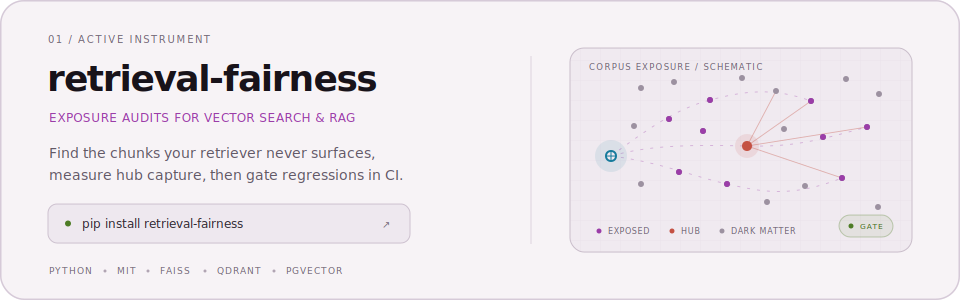

  <picture>
    <source media="(prefers-color-scheme: dark)" srcset="./assets/hero-dark.svg">
    <source media="(prefers-color-scheme: light)" srcset="./assets/hero-light.svg">
    
  </picture>

## `02 / CURRENT SIGNAL`

<a href="https://github.com/derishabl/retrieval-fairness">
  <picture>
    <source media="(prefers-color-scheme: dark)" srcset="./assets/project-dark.svg">
    <source media="(prefers-color-scheme: light)" srcset="./assets/project-light.svg">
    
  </picture>
</a>

**[retrieval-fairness](https://github.com/derishabl/retrieval-fairness)** is an early-stage, open-source exposure audit for vector search. It measures corpus coverage, dark matter, Gini concentration, hub capture, and retrieval regressions — then turns the result into a report or a CI gate.

  <a href="https://github.com/derishabl/retrieval-fairness#quick-start"><code>quick start ↗</code></a>
  &nbsp;·&nbsp;
  <a href="https://github.com/derishabl/retrieval-fairness/blob/main/docs/case_study_nq.md"><code>case study ↗</code></a>
  &nbsp;·&nbsp;
  <a href="https://github.com/derishabl/retrieval-fairness/blob/main/docs/comparison.md"><code>research notes ↗</code></a>

 
 

---

  THE SIGNAL IS THE WORK &nbsp;·&nbsp; EVERYTHING ELSE IS NOISE

